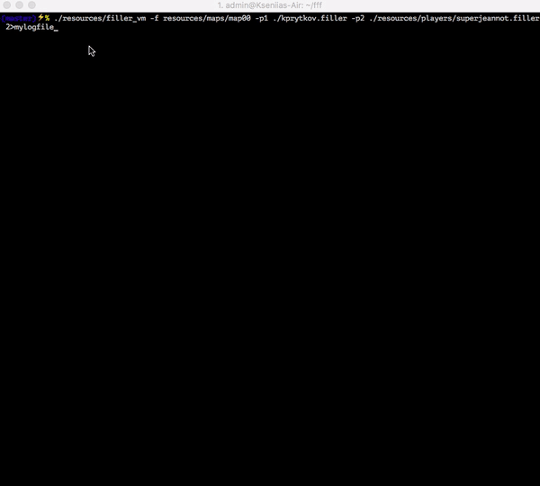

# Filler

```
$ make (inside libft folder)
``` 
```
$ make (in the root folder)
```
to see the game in the terminal:
```
$./resources/filler_vm -f resources/maps/map00 -p1 ./kprytkov.filler -p2 ./resources/players/superjeannot.filler 2>mylogfile
```


to see python game:
create directory /home/kprytkov/pygame and then run `$ pip install --target=/home/kprytkov/pygame pygame`;
```
$ python ./visual.py -f resources/maps/map00 -p1 ./kprytkov.filler -p2 ./resources/players/superjeannot.filler
```
