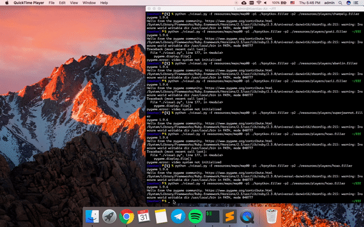

# Filler

```
$ make (inside libft folder)
``` 
```
$ make (in the root folder)
```
to see the game in the terminal:
```
$./resources/filler_vm -f resources/maps/map00 -p1 ./kprytkov.filler -p2 ./resources/players/superjeannot.filler 2>mylogfile
```


to see python game:
create directory /home/kprytkov/pygame and then run `$ pip install --target=/home/kprytkov/pygame pygame`;
```
$ python ./visual.py -f resources/maps/map00 -p1 ./kprytkov.filler -p2 ./resources/players/superjeannot.filler
```



- check for memory leaks: `while true;do leaks -q kprytkov.filler;sleep 2;clear;done`
or add this flag to the Makefile: `-fsanitize=address`:
```
FLAGS = -O3 -Wall -Wextra -Werror -Iinclude/ -Ilibft/ -Llibft/ -lft -fsanitize=address
```
or u can always use `valgrind`;
- [link to convert video to gif](https://ezgif.com/video-to-gif/ezgif-2-70f70735175d.mov)